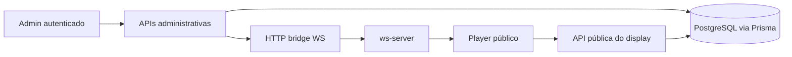

# Project Documentation Implementation Plan

> **For agentic workers:** REQUIRED SUB-SKILL: Use superpowers:subagent-driven-development (recommended) or superpowers:executing-plans to implement this plan task-by-task. Steps use checkbox (`- [ ]`) syntax for tracking.

**Goal:** produzir a documentação enterprise do projeto `digital-signage` em PT-BR, cobrindo README principal, READMEs por módulo, arquitetura, ADRs, diagramas Mermaid e runbooks operacionais.

**Architecture:** a documentação será organizada em camadas: entrada rápida pela raiz, aprofundamento por módulo perto do código, visão transversal em `docs/architecture`, decisões em `docs/adr` e operação em `docs/runbooks`. O conteúdo deve refletir o comportamento real do projeto, sempre explicando primeiro visão de alto nível, depois fluxo técnico e por fim detalhes de implementação.

**Tech Stack:** Markdown, Mermaid, Next.js 14, React 18, TypeScript, Prisma, NextAuth, LDAP, Express, WebSocket.

---

## File Structure

**Create:**
- `docs/architecture/README.md`
- `docs/architecture/system-overview.md`
- `docs/architecture/auth-and-route-protection.md`
- `docs/architecture/display-content-playback.md`
- `docs/architecture/realtime-and-sync.md`
- `docs/architecture/module-dependency-map.md`
- `docs/adr/README.md`
- `docs/adr/001-middleware-as-auth-boundary.md`
- `docs/adr/002-ldap-as-identity-source.md`
- `docs/adr/003-admin-user-as-local-operational-mirror.md`
- `docs/adr/004-admin-and-public-player-separation.md`
- `docs/adr/005-admin-preview-reuses-public-player-via-iframe.md`
- `docs/adr/006-websocket-as-invalidation-signal.md`
- `docs/adr/007-ws-server-sidecar.md`
- `docs/adr/008-display-sync-by-displayid-and-startat.md`
- `docs/runbooks/README.md`
- `docs/runbooks/local-development.md`
- `docs/runbooks/ldap-login-troubleshooting.md`
- `docs/runbooks/websocket-and-realtime-troubleshooting.md`
- `docs/runbooks/uploads-and-file-serving-troubleshooting.md`
- `docs/runbooks/playback-and-black-screen-troubleshooting.md`
- `docs/runbooks/display-sync-validation.md`
- `docs/runbooks/database-and-prisma-checks.md`
- `src/app/admin/README.md`
- `src/app/display/README.md`
- `src/app/api/admin/README.md`
- `src/app/api/display/README.md`
- `src/app/api/file/README.md`
- `src/components/admin/displays/README.md`
- `src/components/auth/README.md`
- `src/components/ui/README.md`
- `src/lib/auth/README.md`
- `src/lib/README.md`
- `prisma/README.md`
- `ws-server/README.md`

**Modify:**
- `README.md`

**Reference inputs:**
- `DOCUMENTATION_RULES.md`
- `AGENTS.md`
- `docs/superpowers/specs/2026-05-08-project-documentation-design.md`

### Task 1: Reescrever o README principal

**Files:**
- Modify: `README.md`
- Reference: `DOCUMENTATION_RULES.md`
- Reference: `AGENTS.md`

- [ ] **Step 1: Registrar a estrutura obrigatória do README raiz**

```md
# Digital Signage

## 1. Objetivo do projeto
## 2. Stack utilizada
## 3. Arquitetura geral
## 4. Estrutura de diretórios
## 5. Fluxo principal da aplicação
## 6. Como executar
## 7. Variáveis de ambiente
## 8. Integrações
## 9. Convenções
## 10. Troubleshooting
```

- [ ] **Step 2: Reescrever o conteúdo com a ordem editorial aprovada**

```md
## 3. Arquitetura geral

### Visão de alto nível
- superfície admin autenticada
- player público isolado
- APIs administrativas e públicas
- Prisma/PostgreSQL como fonte de verdade
- ws-server como sidecar de realtime

### Fluxo técnico
1. admin faz mutação
2. API grava no banco ou arquivos
3. API emite evento via bridge WS
4. player recebe evento
5. player recarrega estado do display

### Detalhe de implementação
- `src/app/admin/**`
- `src/app/display/**`
- `src/app/api/**`
- `src/lib/ws.ts`
- `ws-server/server.js`
```

- [ ] **Step 3: Validar se o README cobre as 10 seções obrigatórias**

Run: `node -e "const fs=require('fs');const s=fs.readFileSync('README.md','utf8');const required=['## 1. Objetivo do projeto','## 2. Stack utilizada','## 3. Arquitetura geral','## 4. Estrutura de diretórios','## 5. Fluxo principal da aplicação','## 6. Como executar','## 7. Variáveis de ambiente','## 8. Integrações','## 9. Convenções','## 10. Troubleshooting'];const missing=required.filter(x=>!s.includes(x));if(missing.length){console.error(missing.join('\n'));process.exit(1)}"`
Expected: sem saída e exit code 0

### Task 2: Criar READMEs por módulo perto do código

**Files:**
- Create: `src/app/admin/README.md`
- Create: `src/app/display/README.md`
- Create: `src/app/api/admin/README.md`
- Create: `src/app/api/display/README.md`
- Create: `src/app/api/file/README.md`
- Create: `src/components/admin/displays/README.md`
- Create: `src/components/auth/README.md`
- Create: `src/components/ui/README.md`
- Create: `src/lib/auth/README.md`
- Create: `src/lib/README.md`
- Create: `prisma/README.md`
- Create: `ws-server/README.md`

- [ ] **Step 1: Aplicar o template modular padrão a todos os módulos**

```md
# <Nome do módulo>

## 1. Responsabilidade
## 2. Fluxo interno
## 3. Dependências
## 4. Eventos
## 5. Regras importantes
## 6. Pontos críticos
## 7. Exemplo de uso
```

- [ ] **Step 2: Preencher cada README com comportamento observado no código**

```md
## 1. Responsabilidade
Este módulo descreve as rotas administrativas de displays, responsáveis por listar, criar, editar, organizar conteúdos e abrir preview do player público.

## 2. Fluxo interno
### Alto nível
O admin funciona como superfície autenticada para operar displays.

### Fluxo técnico
As páginas em `src/app/admin/displays/**` fazem fetch server-side com Prisma e compõem componentes em `src/components/admin/displays`.

### Detalhe de implementação
- `page.tsx` de listagem carrega displays com contagem de conteúdos
- `new/page.tsx` e `[id]/page.tsx` usam `DisplayForm`
- `[id]/preview/page.tsx` incorpora `/display/[id]` em `iframe`
```

- [ ] **Step 3: Validar a presença da estrutura obrigatória nos READMEs modulares**

Run: `node -e "const fs=require('fs');const files=['src/app/admin/README.md','src/app/display/README.md','src/app/api/admin/README.md','src/app/api/display/README.md','src/app/api/file/README.md','src/components/admin/displays/README.md','src/components/auth/README.md','src/components/ui/README.md','src/lib/auth/README.md','src/lib/README.md','prisma/README.md','ws-server/README.md'];const required=['## 1. Responsabilidade','## 2. Fluxo interno','## 3. Dependências','## 4. Eventos','## 5. Regras importantes','## 6. Pontos críticos','## 7. Exemplo de uso'];for(const file of files){const s=fs.readFileSync(file,'utf8');const missing=required.filter(x=>!s.includes(x));if(missing.length){console.error(file+'\n'+missing.join('\n'));process.exit(1)}}"`
Expected: sem saída e exit code 0

### Task 3: Produzir documentação transversal de arquitetura

**Files:**
- Create: `docs/architecture/README.md`
- Create: `docs/architecture/system-overview.md`
- Create: `docs/architecture/auth-and-route-protection.md`
- Create: `docs/architecture/display-content-playback.md`
- Create: `docs/architecture/realtime-and-sync.md`
- Create: `docs/architecture/module-dependency-map.md`

- [ ] **Step 1: Criar o índice de arquitetura**

```md
# Arquitetura

- `system-overview.md`
- `auth-and-route-protection.md`
- `display-content-playback.md`
- `realtime-and-sync.md`
- `module-dependency-map.md`
```

- [ ] **Step 2: Incluir diagramas Mermaid em cada documento quando houver ganho de clareza**

```md

```

- [ ] **Step 3: Validar a existência de Mermaid nos documentos de arquitetura planejados**

Run: `node -e "const fs=require('fs');const files=['docs/architecture/system-overview.md','docs/architecture/auth-and-route-protection.md','docs/architecture/display-content-playback.md','docs/architecture/realtime-and-sync.md','docs/architecture/module-dependency-map.md'];for(const file of files){const s=fs.readFileSync(file,'utf8');if(!s.includes('```mermaid')){console.error('Mermaid ausente em '+file);process.exit(1)}}"`
Expected: sem saída e exit code 0

### Task 4: Registrar ADRs inferidas do código

**Files:**
- Create: `docs/adr/README.md`
- Create: `docs/adr/001-middleware-as-auth-boundary.md`
- Create: `docs/adr/002-ldap-as-identity-source.md`
- Create: `docs/adr/003-admin-user-as-local-operational-mirror.md`
- Create: `docs/adr/004-admin-and-public-player-separation.md`
- Create: `docs/adr/005-admin-preview-reuses-public-player-via-iframe.md`
- Create: `docs/adr/006-websocket-as-invalidation-signal.md`
- Create: `docs/adr/007-ws-server-sidecar.md`
- Create: `docs/adr/008-display-sync-by-displayid-and-startat.md`

- [ ] **Step 1: Aplicar o formato ADR em todos os arquivos**

```md
# ADR-001: Middleware como fronteira central de autenticação

## Contexto
## Problema
## Decisão
## Consequências
```

- [ ] **Step 2: Explicitar a evidência técnica de cada decisão**

```md
## Decisão
As rotas `/admin/**` e `/api/admin/**` são protegidas centralmente em `src/middleware.ts`, evitando duplicação de checagens de autenticação em cada handler.

## Consequências
- simplifica handlers administrativos
- desloca a segurança para uma fronteira única
- exige disciplina para manter APIs administrativas sob `/api/admin/**`
```

- [ ] **Step 3: Validar a estrutura mínima das ADRs**

Run: `node -e "const fs=require('fs');const files=fs.readdirSync('docs/adr').filter(f=>/^\d{3}-.*\.md$/.test(f)).map(f=>'docs/adr/'+f);const required=['## Contexto','## Problema','## Decisão','## Consequências'];for(const file of files){const s=fs.readFileSync(file,'utf8');const missing=required.filter(x=>!s.includes(x));if(missing.length){console.error(file+'\n'+missing.join('\n'));process.exit(1)}}"`
Expected: sem saída e exit code 0

### Task 5: Escrever runbooks operacionais

**Files:**
- Create: `docs/runbooks/README.md`
- Create: `docs/runbooks/local-development.md`
- Create: `docs/runbooks/ldap-login-troubleshooting.md`
- Create: `docs/runbooks/websocket-and-realtime-troubleshooting.md`
- Create: `docs/runbooks/uploads-and-file-serving-troubleshooting.md`
- Create: `docs/runbooks/playback-and-black-screen-troubleshooting.md`
- Create: `docs/runbooks/display-sync-validation.md`
- Create: `docs/runbooks/database-and-prisma-checks.md`

- [ ] **Step 1: Criar o índice dos runbooks**

```md
# Runbooks Operacionais

- desenvolvimento local
- autenticação LDAP
- websocket e realtime
- uploads e arquivos
- playback e tela preta
- sincronização de displays
- banco e Prisma
```

- [ ] **Step 2: Estruturar cada runbook como operação executável**

```md
# Troubleshooting de WebSocket e Realtime

## Visão de alto nível
Este runbook ajuda a verificar por que players não estão recebendo atualizações em tempo real.

## Fluxo técnico
1. validar `NEXT_PUBLIC_WS_URL`
2. validar que `ws-server` está escutando em `8080` e `8090`
3. validar emissão via `src/lib/ws.ts`
4. validar `JOIN_DISPLAY` no cliente

## Detalhe de implementação
```bash
node ws-server/server.js
curl -X POST http://<host>:8090/emit -H "Content-Type: application/json" -d '{"displayId":"<id>","event":"CONTENT_UPDATED"}'
```
```

- [ ] **Step 3: Validar a existência dos runbooks obrigatórios**

Run: `node -e "const fs=require('fs');const files=['docs/runbooks/local-development.md','docs/runbooks/ldap-login-troubleshooting.md','docs/runbooks/websocket-and-realtime-troubleshooting.md','docs/runbooks/uploads-and-file-serving-troubleshooting.md','docs/runbooks/playback-and-black-screen-troubleshooting.md','docs/runbooks/display-sync-validation.md','docs/runbooks/database-and-prisma-checks.md'];for(const file of files){if(!fs.existsSync(file)){console.error('Ausente: '+file);process.exit(1)}}"`
Expected: sem saída e exit code 0

### Task 6: Verificação final da documentação

**Files:**
- Verify: `README.md`
- Verify: `src/**/README.md`
- Verify: `docs/architecture/**`
- Verify: `docs/adr/**`
- Verify: `docs/runbooks/**`

- [ ] **Step 1: Verificar a existência de todos os arquivos planejados**

Run: `node -e "const fs=require('fs');const files=['README.md','src/app/admin/README.md','src/app/display/README.md','src/app/api/admin/README.md','src/app/api/display/README.md','src/app/api/file/README.md','src/components/admin/displays/README.md','src/components/auth/README.md','src/components/ui/README.md','src/lib/auth/README.md','src/lib/README.md','prisma/README.md','ws-server/README.md','docs/architecture/README.md','docs/architecture/system-overview.md','docs/architecture/auth-and-route-protection.md','docs/architecture/display-content-playback.md','docs/architecture/realtime-and-sync.md','docs/architecture/module-dependency-map.md','docs/adr/README.md','docs/adr/001-middleware-as-auth-boundary.md','docs/adr/002-ldap-as-identity-source.md','docs/adr/003-admin-user-as-local-operational-mirror.md','docs/adr/004-admin-and-public-player-separation.md','docs/adr/005-admin-preview-reuses-public-player-via-iframe.md','docs/adr/006-websocket-as-invalidation-signal.md','docs/adr/007-ws-server-sidecar.md','docs/adr/008-display-sync-by-displayid-and-startat.md','docs/runbooks/README.md','docs/runbooks/local-development.md','docs/runbooks/ldap-login-troubleshooting.md','docs/runbooks/websocket-and-realtime-troubleshooting.md','docs/runbooks/uploads-and-file-serving-troubleshooting.md','docs/runbooks/playback-and-black-screen-troubleshooting.md','docs/runbooks/display-sync-validation.md','docs/runbooks/database-and-prisma-checks.md'];const missing=files.filter(f=>!fs.existsSync(f));if(missing.length){console.error(missing.join('\n'));process.exit(1)}"`
Expected: sem saída e exit code 0

- [ ] **Step 2: Verificar se o README principal aponta para a documentação criada**

Run: `node -e "const fs=require('fs');const s=fs.readFileSync('README.md','utf8');const required=['docs/architecture','docs/adr','docs/runbooks'];const missing=required.filter(x=>!s.includes(x));if(missing.length){console.error(missing.join('\n'));process.exit(1)}"`
Expected: sem saída e exit code 0

- [ ] **Step 3: Revisão editorial final**

Run: `node -e "const fs=require('fs');const files=['README.md','docs/architecture/system-overview.md','docs/architecture/auth-and-route-protection.md','docs/architecture/display-content-playback.md','docs/architecture/realtime-and-sync.md'];for(const file of files){const s=fs.readFileSync(file,'utf8');if(!/alto nível|Visão de alto nível/i.test(s)||!/fluxo técnico|Fluxo técnico/i.test(s)||!/Detalhe de implementação/i.test(s)){console.error('Estrutura editorial incompleta em '+file);process.exit(1)}}"`
Expected: sem saída e exit code 0
